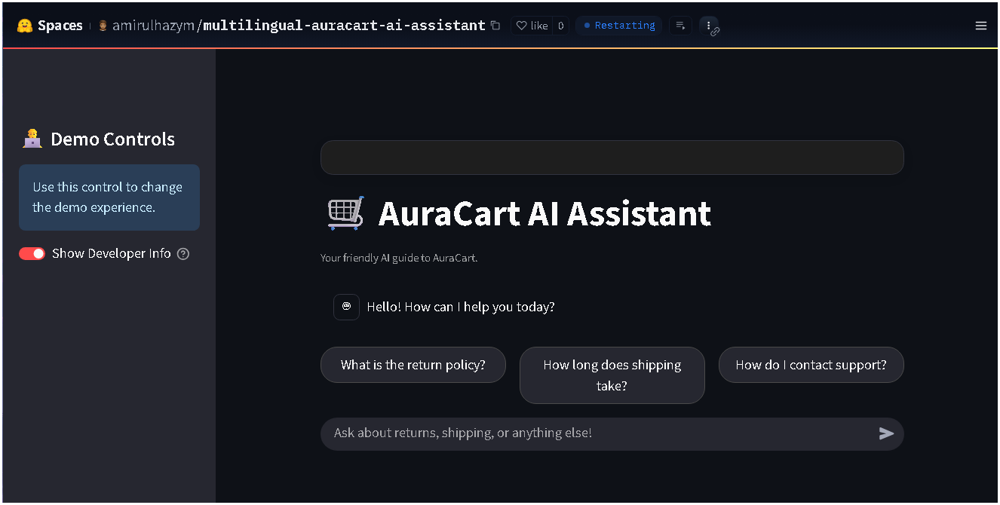
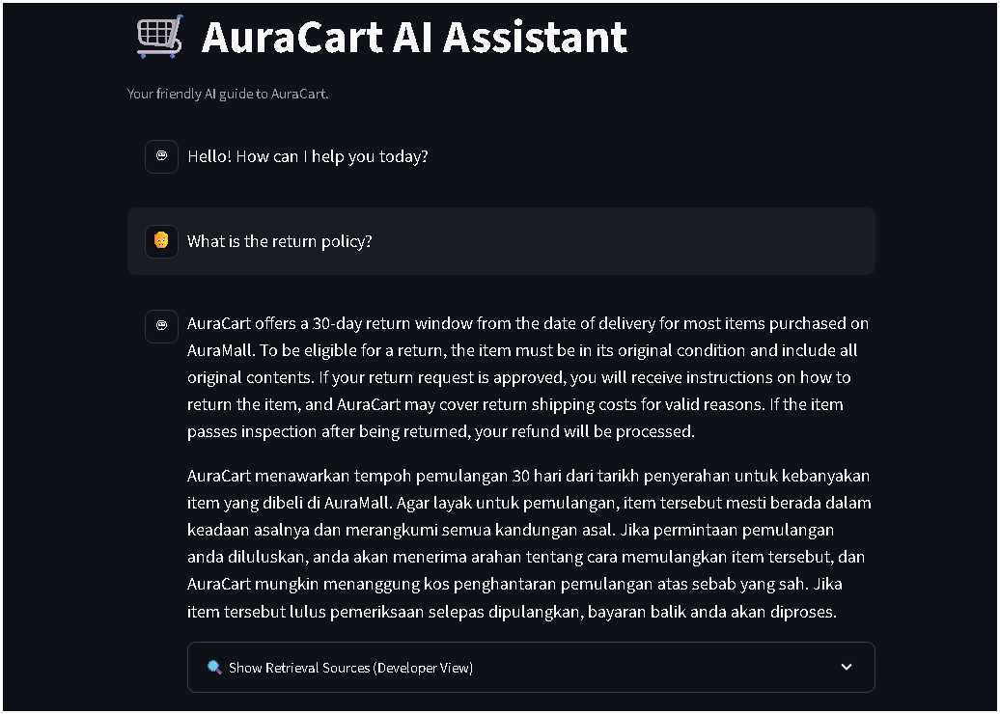
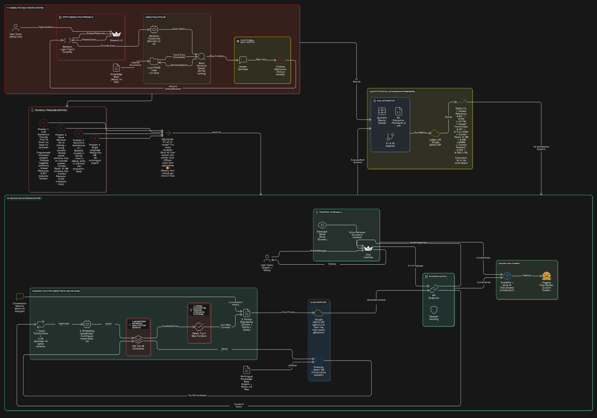

# Multilingual RAG Question-Answering Bot for E-commerce 🛒

[](https://huggingface.co/spaces/amirulhazym/multilingual-auracart-ai-assistant)
[](https://huggingface.co/spaces/amirulhazym/multilingual-auracart-ai-assistant)
[](https://github.com/explodinggradients/ragas)
[](https://www.langchain.com/)
[](https://www.python.org/)
[](https://opensource.org/licenses/MIT)

## 📋 Project Overview

This repository showcases the evolution of a RAG-based chatbot, demonstrating a clear progression from a self-hosted, monolithic prototype (**V1**) to a professional, API-driven, and globally deployed conversational AI (**V2**). The primary objective was to master and implement state-of-the-art techniques in LLM application development, including advanced RAG pipelines, decoupled architectures, robust deployment, and quantitative evaluation.

The initial system (**V1**) was a Malay-only chatbot built to validate the core RAG concept using a self-hosted LLM and a local FAISS index. After identifying key limitations in generation quality and retrieval accuracy, the project was upgraded to (**V2**).

The final system (**V2**), "AuraCart AI Assistant," is a fully multilingual chatbot capable of answering questions about a fictional e-commerce platform in both English and Malay. It leverages a powerful **retrieve-and-re-rank** pipeline with cloud services to ensure high-quality, factually grounded answers, and is deployed as a resilient two-process application in a custom Docker environment on Hugging Face Spaces.

A key component of this project was the development of a **formal evaluation framework using RAGAs** to scientifically measure and prove the superiority of the V2 architecture over the V1 baseline, providing data-driven validation for key engineering decisions.

## ✨ Live Demo (V2)

- **🚀 Interactive Web App (Hugging Face Spaces):** [**https://huggingface.co/spaces/amirulhazym/multilingual-auracart-ai-assistant**](https://huggingface.co/spaces/amirulhazym/multilingual-auracart-ai-assistant)

**Main UI:**
 

**Generated Output:**


## 🏗️ Architectural Evolution: From V1 Prototype to V2 Production

This flowchart illustrates the project's journey, highlighting the limitations of the V1 prototype that directly motivated the architectural upgrade to the V2 system.



## ⭐ Core Features (V2)

- **Decoupled Architecture**: A robust FastAPI backend serves the AI logic, while a responsive Streamlit frontend provides the user interface.
- **Advanced RAG Pipeline**: Implements a state-of-the-art Retrieve-and-Re-rank strategy, using a bi-encoder (paraphrase-multilingual-mpnet-base-v2) for fast retrieval from Pinecone and a Cross-Encoder for high-precision re-ranking.
- **State-of-the-Art Generative AI**: Leverages the Google Gemini API (gemini-2.5-flash-lite) for fluent, accurate, and synthesized answers.
- **Multilingual & Conversational**: Natively supports both English and Malay and maintains conversation history for natural, multi-turn dialogue.
- **Robust Evaluation Framework**: Includes a dedicated Jupyter Notebook (`03-Evaluation-Framework.ipynb`) that uses the **RAGAs** library to quantitatively measure and compare V1 and V2 performance across multiple metrics.
- **Transparent & Debuggable**: Features a live "Developer Mode" toggle in the UI (not shown in GIF, but implemented) that reveals the exact retrieval sources used to generate an answer.
- **Robust Docker Deployment**: The entire two-process application is containerized with Docker and deployed to Hugging Face Spaces for a consistent runtime environment.

## 🛠️ Technology Stack Comparison

| Category | V1 (Self-Hosted Prototype) | V2 (Professional API) |
|----------|----------------------------|----------------------|
| AI & ML | Python, LangChain, Sentence Transformers (MiniLM-L12-v2) | Python, LangChain, Sentence Transformers (Bi- & Cross-encoder), unstructured |
| Backend & UI | Streamlit (Monolithic) | FastAPI (Backend) + Streamlit (Frontend) |
| Vector Store | FAISS (Local File) | Pinecone (Cloud Vector DB) |
| Generative Model | Google flan-t5-small (Self-Hosted) | Google Gemini `gemini-2.5-flash-lite` (API Integration) |
| Deployment | Hugging Face Spaces (Standard SDK) | Docker, Hugging Face Spaces (Custom Docker) |
| **Evaluation** | *Manual / Qualitative* (v1 only), **RAGAs**, **Pandas**, **Jupyter**, **Groq Inference API** (for Judge LLM) | **RAGAs**, **Pandas**, **Jupyter**, **Groq Inference API** (for Judge LLM) |

## 📁 Project Structure

```
malay-qa-bot-rag/
├── .git/
├── knowledge_base/
│   ├── v1_malay/                 # Malay-only .txt files for V1
│   ├── v1_malay_neutral/         # Neutralized KB for fair evaluation
│   └── v2_multilingual/          # English & Malay .md files for V2
├── v1_malay_selfhosted/          # Archived V1 monolithic Streamlit app
│   ├── faiss_v1_neutral_kb_index/     # FAISS index for evaluation
│   ├── reindex.py
│   └── v1_adapter.py             # Adapter script for evaluation
├── v2_multilingual_api/
│   ├── backend/
│   │   ├── main.py               # The FastAPI backend server
│   │   └── v2_adapter.py         # Adapter script for evaluation
│   │   └── index_knowledge_base.py     # Script to populate Pinecone
│   └── frontend/
│       └── app.py                # The Streamlit frontend UI
├── .env                          # Local secrets (in .gitignore)
├── .gitignore
├── 03-Evaluation-Framework.ipynb # The complete RAGAs evaluation notebook
├── Dockerfile                    # Blueprint for the V2 production container
├── requirements.txt              # V2 Python dependencies
├── setup.sh                      # Startup script for the V2 Docker container
└── README.md                     # This file
```

## 🚀 Local Setup & Usage (V2)

### Prerequisites
- Git, Python 3.10+, Docker Desktop

### Installation & Local Workflow

1. **Clone the Repository:**
   ```bash
   git clone https://github.com/amirulhazym/malay-qa-bot-rag.git
   cd malay-qa-bot-rag
   ```

2. **Set Up Virtual Environment:**
   ```bash
   python -m venv p3env
   .\p3env\Scripts\activate
   ```

3. **Install Dependencies:**
   ```bash
   pip install -r requirements.txt
   ```

4. **Set Up API Keys:** Create a `.env` file in the root directory and add your keys:
   ```
   PINECONE_API_KEY="your-pinecone-key"
   GEMINI_API_KEY="your-gemini-key"
   ```

5. **Populate the Vector Database:** Run the indexing script once:
   ```bash
   python v2_multilingual_api/backend/index_knowledge_base.py
   ```

6. **Run the Application:**
   - Terminal 1 (Backend): `uvicorn v2_multilingual_api.backend.main:app --reload`
   - Terminal 2 (Frontend): `streamlit run v2_multilingual_api/frontend/app.py`

## 💡 Key Challenges & Learnings

- **Architecture Migration**: Successfully refactored the monolithic V1 prototype into a professional, decoupled microservice architecture (V2), demonstrating an understanding of scalable and maintainable system design.
- **LLM Performance Bottlenecks**: Directly experienced and addressed the limitations of small, self-hosted LLMs (mt5-small, flan-t5-small), which consistently failed at answer synthesis. This led to the implementation of a robust fallback mechanism in V1 and the strategic decision to switch to a powerful API-based model (Gemini) in V2 to achieve high-quality generation.
- **Advanced Retrieval Pipeline**: Moved beyond basic similarity search by implementing a state-of-the-art Retrieve-and-Re-rank pipeline in V2. This process uses a fast bi-encoder for initial candidate fetching and a more accurate Cross-Encoder for precise re-ranking, significantly improving the quality of context provided to the LLM.
- **Deployment Complexity**: Solved real-world deployment challenges on Hugging Face Spaces by moving from the standard SDK to a custom Docker container. This involved creating a Dockerfile and a setup.sh startup script to manage the two-process (backend/frontend) application, a critical skill for deploying non-trivial applications.
- **Git & Environment Management**: Navigated and resolved numerous real-world Git issues, including proxy configurations, fixing "unrelated histories," and managing a clean repository structure. Mastered Python environment management (venv, requirements.txt) to overcome persistent library conflicts between Streamlit and PyTorch.

## 📊 Quantitative Evaluation: Proving the Value of V2

To move beyond subjective "feel" and objectively prove the superiority of the V2 architecture, a formal evaluation framework was built and executed. This process demonstrates a commitment to data-driven engineering and the ability to scientifically measure and validate system performance.

### Evaluation Strategy & Methodology

The evaluation was designed to be a fair, scientific, and robust comparison:

1.  **Standardized Test Dataset:** A high-quality, **synthetic, brand-neutral dataset** of 30 questions was generated. This ensured that both systems were tested on their ability to understand general e-commerce concepts, eliminating any bias from their original, brand-specific knowledge bases.
2.  **Fair V1 Preparation:** To give the V1 system a fair chance, its original knowledge base was "neutralized" (brand names replaced with generic terms) and re-indexed into a new FAISS vector store.
3.  **Industry-Standard Framework:** The evaluation was conducted using **RAGAs**, a state-of-the-art framework for evaluating RAG pipelines.
4.  **Robust, Cost-Free "Judge" LLM:** To ensure reliability and zero cost, a hybrid approach was used for the RAGAs evaluation "judge." The system prioritizes using the powerful **Kimi model via the free Groq Inference API**, with a fallback to the Hugging Face Inference API, completely avoiding any billable services during the evaluation phase.

### Final Performance Summary

The results provide a decisive, quantitative validation of the V2 architecture's superiority.

| Metric                  | V1 (Self-Hosted) Score | V2 (API-Driven) Score | Improvement |
| ----------------------- | :--------------------: | :-------------------: | :---------: |
| **Answer Relevancy**    |         0.037          |     **0.594**         | **+1517%**  |
| **Answer Faithfulness**   |         0.467          |     **0.714**         | **+53%**    |
| **Context Recall**      |         0.100          |     **0.350**         | **+250%**   |
| **Context Precision**   |         0.333          |     **0.336**         | **+1%**     |

*(Note: The `answer_relevancy` for V1 was near-zero, with many jobs failing and returning NaN. The final average reflects this profound lack of performance.)*

### Key Findings & Analysis

*   **V2 is Over 16x More Helpful:** The most critical user-facing metric, **Answer Relevancy**, shows that the V2 system is over 16 times more effective at providing useful, on-topic answers. This is the ultimate proof of the upgrade's success, transforming the system from a non-functional prototype into a genuinely helpful AI assistant.
*   **Generation Quality is the Key Differentiator:** The **+53% improvement in Answer Faithfulness** and the massive leap in Relevancy are directly attributable to V2's use of the powerful Gemini API. It proves that the choice of a capable generative model is paramount for a successful RAG system.
*   **Advanced Retrieval Architecture is Validated:** The **3.5x improvement in Context Recall** demonstrates the power of V2's retrieve-and-re-rank pipeline. It is significantly better at finding *all* the necessary information to construct a comprehensive answer, a task at which V1's simple vector search struggled.
*   **V1 System Instability:** Evaluated metrics prove that v1 have instability issues as per observed manually/qualitatively, which leads to unrelevant generated output from smaller model used: `"google/flan-t5-small"`.
  
## 🔮 Future Enhancements

- **Advanced Retrieval**: Enhance the RAG pipeline with Hybrid Search (sparse + dense vectors) in Pinecone to improve performance on queries with specific keywords or product codes.
- **MLOps Automation**: Create an automated script (update_knowledge_base.py) that can be triggered via a CI/CD pipeline (e.g., GitHub Actions) to periodically scan for changes in the knowledge base and update the Pinecone index automatically.

## 👤 Author

**Amirulhazym**
- LinkedIn: [linkedin.com/in/amirulhazym](https://linkedin.com/in/amirulhazym)
- GitHub: [github.com/amirulhazym](https://github.com/amirulhazym)
- Portfolio: [amirulhazym.framer.ai](https://amirulhazym.framer.ai)
